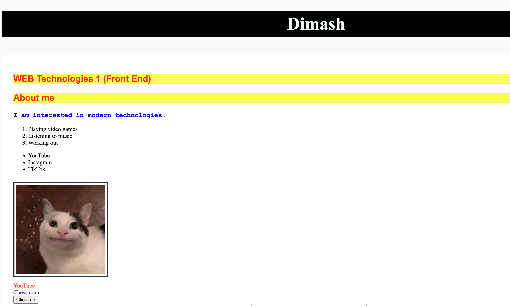
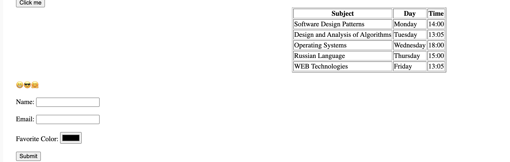
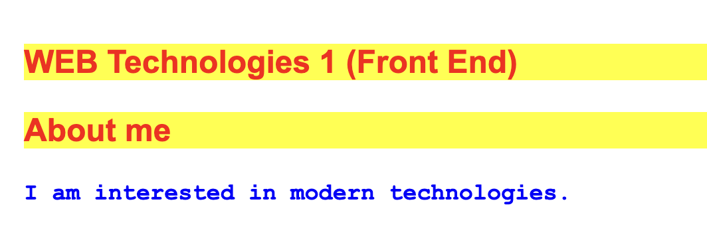
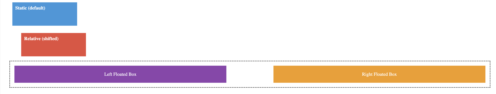
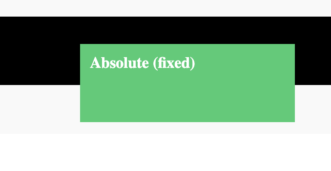
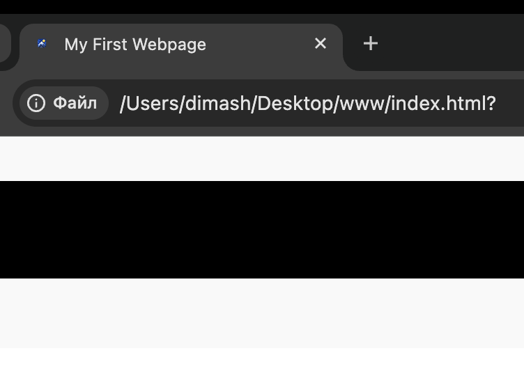

# Assignment #1: HTML & CSS Basics

**Name:** Dinmukhammed Dauletkhan  
**Group:** SE-2538

## Work Process Summary
In this assignment, I created my first structured webpage using HTML and CSS. I started by setting up the basic HTML boilerplate and organizing the content with headings, paragraphs, and lists. Then, I added media elements like images and links, as well as a table for my class schedule and an input form. After structuring the webpage, I applied CSS to style the elements. I used inline, internal, and external CSS methods, applied different selectors (classes and IDs), and customized the box model (padding, margins, borders). Finally, I learned how to position elements (static, relative, absolute) and use float properties for layout creation. The webpage was successfully deployed on GitHub Pages.

---

## Assignment Parts and Screenshots

### Part 1: Introduction to HTML
**Tasks:**
- Add HTML boilerplate and title.
- Structure text using headings and paragraphs.
- Add ordered and unordered lists (hobbies and favorite websites).
- Insert an image and clickable links.
- Add a simple button.

**Screenshot:**
 

### Part 2: Intermediate HTML
**Tasks:**
- Create a weekly schedule table (Subject, Day, Time).
- Add emojis into a paragraph.
- Create an HTML form with Name, Email, Color inputs, and a Submit button.
*(Note: Step 6 Optional Challenge was skipped).*

**Screenshot:**

### Part 3: Introduction to CSS
**Tasks:**
- Implement Inline CSS, Internal CSS, and External CSS (`style.css`).
- Use CSS Syntax & Selectors (element, class, ID).
- Differentiate and apply `.highlight` class and `#main-heading` ID.

**Screenshot:**

### Part 4: Intermediate CSS
**Tasks:**
- Add a custom favicon.
- Use `
` to group content into Header, Main Content, and Footer, and style them.
- Apply the Box Model (borders, margins, padding).
- Implement CSS Positioning (static, relative, absolute).
- Use different CSS sizing units (`px`, `%`, `em`, `rem`).
- Implement Float and Clear layout with two boxes.
- Publish the website using GitHub Pages.

**Screenshot:**

---
**GitHub Pages URL:** https://adoeveshiron.github.io/My-First-Website/
